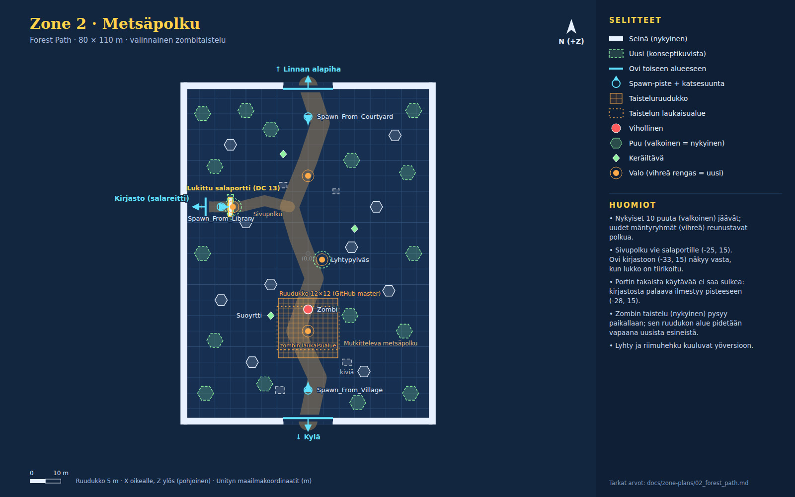

# Zone 2 · Metsäpolku (`Zone_2_ForestPath`)

Konseptikuvat: [02a_forest_path_day](concepts/02a_forest_path_day.jpg) · [02b_forest_path_night](concepts/02b_forest_path_night.jpg)

Mutkitteleva metsäpolku kylästä (etelä) linnan alapihalle (pohjoinen). Länteen haarautuu sivupolku tiirikoitavalle salaportille (DC 13), jonka takaa aukeaa salareitti kirjastoon.

Pelaajan aloituspaikka scenessä (0, 0.5, -44). Directional nyt: väri #bfe0b2, int 1.1, rotaatio (50, -30, 0).

## Paikallisen masterin erot (käytä niitä)

- Tiirikointi on paikallisessa masterissa minipeli (PR #10). Portin paikka ja DC pysyvät samoina.

## Nykyiset (GitHub master, pidä ennallaan)

| Nimi | Tyyppi | Sijainti (x, y, z) | Koko (x × y × z) | Rot Y | Collider | Rakennus / huomio |
|---|---|---|---|---|---|---|
| Forest_Ground | lattia | (0, -0.5, 0) | 80 × 1 × 110 | 0 | kyllä | Cube, M_Fern.mat |
| Forest_Wall_West | seinä | (-40, 3, 0) | 2 × 6 × 110 | 0 | kyllä | Cube, M_Ruined_walls.mat |
| Forest_Wall_East | seinä | (40, 3, 0) | 2 × 6 × 110 | 0 | kyllä | Cube, M_Ruined_walls.mat |
| Forest_Wall_South_L | seinä | (-24, 3, -54) | 32 × 6 × 2 | 0 | kyllä | Cube |
| Forest_Wall_South_R | seinä | (24, 3, -54) | 32 × 6 × 2 | 0 | kyllä | Cube |
| Forest_Wall_North_L | seinä | (-24, 3, 54) | 32 × 6 × 2 | 0 | kyllä | Cube |
| Forest_Wall_North_R | seinä | (24, 3, 54) | 32 × 6 × 2 | 0 | kyllä | Cube |
| Pine_tree (nykyiset) ×10 | puu | (-18, 0, -35); (-28, 0, -15); (-20, 0, 10); (-25, 0, 35); (18, 0, -38); (26, 0, -12); (22, 0, 15); (28, 0, 38); (-12, 0, -10); (14, 0, 2) | r 2 m | 0 | kyllä | Pine_tree.prefab (Flora_And_Flanks) |
| SwampHerb ×3 | keräiltävä | (-12, 0.4, -20); (15, 0.4, 8); (-8, 0.4, 32) |  | 0 |  | Sphere 0.8 + ChestRewardInteraction (Item_SwampHerb), Mirabelin tehtävä |
| ForestLight_South | valo | (0, 6, -25) | piste, #8cd973, range 30, int 2 | 0 |  | shadows Soft |
| ForestLight_North | valo | (0, 6, 25) | piste, #73bfa6, range 30, int 2 | 0 |  | shadows Soft |
| Spawn_From_Village | spawn | (0, 0.5, -44) |  | 0 |  | StartSpawnPoint + trigger 2 x 2 x 2 |
| Spawn_From_Courtyard | spawn | (0, 0.5, 44) |  | 180 |  | StartSpawnPoint + trigger 2 x 2 x 2 |
| Spawn_From_Library | spawn | (-28, 0.5, 15) |  | 90 |  | StartSpawnPoint + trigger 2 x 2 x 2 |
| Door_Forest_Village | ovi | (0, 0, -53) | aukko 16 m, trigger 8 × 4 × 3 | 180 |  | → `Zone_1_VillageAndCellar` / `Spawn_From_Forest`; kehote "Return to Oakhaven Village (Village)" CreateSceneDoorway: Arch.prefab x1.4 + 2x Pillar.prefab, DoorTeleporter-trigger 8 x 4 x 3 m |
| Door_Forest_Courtyard | ovi | (0, 0, 53) | aukko 16 m, trigger 8 × 4 × 3 | 0 |  | → `Zone_3_CastleCourtyard` / `Spawn_From_Forest`; kehote "Enter Castle Courtyard (Wing 1)" CreateSceneDoorway: Arch.prefab x1.4 + 2x Pillar.prefab, DoorTeleporter-trigger 8 x 4 x 3 m |
| Door_Forest_Library_Secret | ovi | (-33, 0, 15) | aukko 6 m, trigger 6 × 4 × 3 | -90 |  | → `Zone_4_Library` / `Spawn_From_SecretPath`; kehote "Slip into the Grand Archives (Secret Path)" CreateSceneDoorway: Arch.prefab x1.4 + 2x Pillar.prefab, DoorTeleporter-trigger 6 x 4 x 3 m SetActive(false) kunnes portti on tiirikoitu (LockpickInteraction.hiddenPathObject). |
| Locked_Secret_Gate | lukittu portti | (-25, 2.5, 15) | 1.2 × 5 × 6 | 0 | kyllä | Cube + LockpickInteraction: DC 13, rewardGold 25, hasTrap, trapDamage 4 |
| CombatGrid_Forest | taisteluruudukko | (0, 0.05, -24) | 12 × 12 ruutua × 1.6 m | 0 |  | CombatGrid.prefab, Forest_Zombie_Encounter-objektin alla (SetupRiggedEnemiesEditor.DressZone2) Pidä ruudukon alue (x -9.6…9.6, z -33.6…-14.4) vapaana uusista kiinteistä esineistä. |
| Forest_Zombie | vihollinen | (0, 1.5, -18) |  | 180 |  | Enemy_Zombie.prefab "Rotting Zombie" HP 20, AC 11, DMG 4; StandOnGround; SetActive(false) kunnes taistelu (DressZone2) |
| Forest_Zombie_Trigger | laukaisualue | (0, 2.5, -24) | 20 × 6 × 14 | 0 |  | BoxCollider trigger + DungeonRoomController (roomLocation "Forest", ei pomoa) (DressZone2) |

## Uudet (rakennetaan konseptikuvien mukaan)

| Nimi | Tyyppi | Sijainti (x, y, z) | Koko (x × y × z) | Rot Y | Collider | Rakennus / huomio |
|---|---|---|---|---|---|---|
| Forest_Path_Main | polku | (0, -54) → (3, -40) → (-4, -25) → (2, -8) → (-3, 5) → (-6, 15) → (0, 30) → (4, 42) → (0, 54) | leveys 6 m | 0 | ei | Tasainen polkumateriaali (ruskea #c89a5c) maahan: litteät kuutiot 0.02 m tai Tile_*.prefab-kivet; reunoille Grass/Fern Leveys 6 m, kulkee ovelta ovelle. |
| Forest_Path_Branch | polku | (-6, 15) → (-14, 17) → (-22, 15) → (-33, 15) | leveys 3.5 m | 0 | ei | sama kuin pääpolku, kapeampi Haarautuu pääpolulta (-6, 15) salaportille ja salaovelle. |
| Gate_Arch_Ivy | esine | (-25, 0, 15) | 8 × 6.5 × 2 | 90 | ei | Arch.prefab (rot 90 kuten sivuovien kaaret) skaala ~1.5 portin ympärille + Leaves_*/Bush_*-muratti; lukko kultaisena (emissive) Pelkkä kehys: Locked_Secret_Gate on edelleen se, joka estää kulun. |
| Pine_Cluster (uudet) ×16 | puu | (-33, 0, -45); (-30, 0, -28); (-34, 0, 0); (-30, 0, 28); (-34, 0, 45); (33, 0, -45); (31, 0, -25); (34, 0, 0); (32, 0, 26); (34, 0, 46); (-12, 0, 40); (14, 0, 30); (13.5, 0, -20); (-14, 0, -42); (16, 0, -48); (-20, 0, 46) | r 2.6 m | 0 | kyllä | 2–3 kpl Pine_tree.prefab / Pine_tree_2.prefab r ≤ 3 m sisällä, satunnainen rot, skaala 0.9–1.3 |
| Rock_Group ×4 | kivi | (12.5, 0, -35); (-8, 0, 22); (9, 0, 20); (-9, 0, -44) | 3 × 1.5 × 2 | 0 | kyllä | Rock_1…4.prefab |
| Lantern_Post | esine | (4.5, 0, -2) | 0.6 × 3.2 × 0.6 | 0 | kyllä | Lamppost.prefab tai street_light.prefab |
| Lantern_Light | valo | (4.5, 2.8, -2) | piste, #ffb04a, range 10, int 1.6 | 0 |  | versio: B (yö) Päällä vain yöversiossa; shadows None |
| Gate_Lock_Glow | valo | (-24.2, 2.6, 15) | piste, #ffd76a, range 6, int 1.2 | 0 |  | versio: A kulta / B syaani #5ae0ff Lukon hehku; shadows None |
| Path_Edge_Scatter | sirottelu | polun reunoilla |  | 0 | ei | ~20 kpl Mushroom_1…4, Flowers_1/2, Fern, Grass_1…3 polun reunoille 1–5 m päähän reunasta Ei collidereita (ei estä kävelyä). |

## Valaistus ja tunnelma

Oletus: **A · Päivä**.

**A · Päivä (oletus)**

- Directional: väri #fff1cc, intensiteetti 1.25, rotaatio (45, -35, 0).
- Ambient (Gradient): taivas #9ccbea, horisontti #bfd8a0, maa #4e6b3a.
- Sumu: Linear #dce8d2, alku 40 m, loppu 130 m.
- Nykyiset vihreät pistevalot jäävät, intensiteetti 2.0 → 1.2.
- Auringonsäteet: 5–7 additiivista läpinäkyvää tasoa (#fff6cf, alpha ≈ 0.12) lounaasta koilliseen.
- Partikkelit: leijuva siitepöly/lehdet, 20–40 kpl, hidas.

**B · Kuutamoyö**

- Directional (kuu): #8fa6e0, intensiteetti 0.35, rotaatio (35, 150, 0).
- Ambient: Flat #1c2244. Skybox tumma #0b1430 + tähdet.
- Sumu: Exponential Squared #5a6a98, tiheys 0.03.
- Lantern_Light päälle (#ffb04a, range 10, int 1.6); portin riimut syaanina #5ae0ff.
- Tulikärpäset: 30 partikkelia #d8ff7a, koko 0.06–0.12.

## Pelilliset huomiot

- Zombin taistelu (Forest_Zombie_Encounter: ruudukko, zombi ja laukaisualue) tulee SetupRiggedEnemiesEditor.DressZone2:sta, ei ZoneSceneBuilderista. Jos Zone 2 rakennetaan uudelleen, aja sen jälkeen CastleOfDice/Setup Rigged Enemies, Bosses & Heroes, muuten zombi puuttuu.
- Älä sulje salaportin takaista käytävää pensailla tai kivillä. Kirjaston kautta saapuva sankari ilmestyy pisteeseen (-28, 15) portin taakse, ja hänen on päästävä pois myös silloin, kun porttia ei ole tiirikoitu (tiirikointi on vain Varkaalle).
- Pidä polku ja ovien edustat (16 m aukot) vapaina kiinteistä esineistä.
- Kamera seuraa lounaasta (offset -6, 12, -12). Yli 4 m korkeat esineet polun eteläpuolella voivat peittää sankarin.
