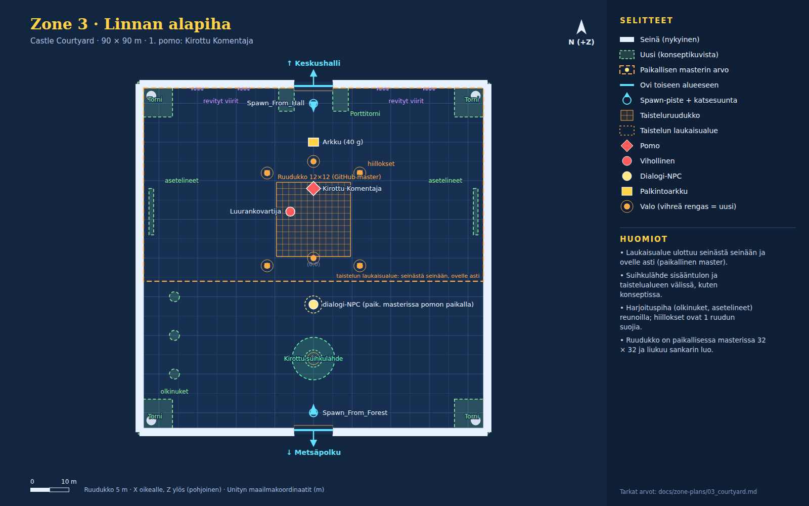

# Zone 3 · Linnan alapiha (`Zone_3_CastleCourtyard`)

Konseptikuvat: [03a_courtyard_storm](concepts/03a_courtyard_storm.jpg) · [03b_courtyard_sunset](concepts/03b_courtyard_sunset.jpg)

Muurien ympäröimä piha. Kirottu Komentaja vartioi pohjoisovea keskushalliin, ja taistelun laukaisualue ulottuu seinästä seinään ja ovelle asti. Etelässä kirottu suihkulähde, sivuilla harjoituspiha.

Pelaajan aloituspaikka scenessä (0, 0.5, -42). Directional nyt: väri #fff2d9, int 1.2, rotaatio (50, -30, 0).

## Paikallisen masterin erot (käytä niitä)

- Laukaisualue on paikallisessa masterissa jo seinästä seinään (x -44…44, z -6…44), joten keskushallin ovelle ei pääse ilman taistelua (ketju "Commander door trigger and bigger grids").
- Taisteluruudukko on paikallisessa masterissa 32 × 32 (51,2 m) ja liukuu niin, että sankari on vähintään 2 ruutua reunan sisäpuolella.
- Dialogi-NPC seisoo paikallisessa masterissa pomon taistelupaikalla, ja dialogi alkaa aina, kun sankari astuu laukaisualueelle. Voitetun pomon NPC ei näy.
- Käytä näissä paikallisen masterin arvoja. Tämä piirros ei muuta laukaisualuetta, ruudukkoa, pomoa eikä NPC:tä.

## Nykyiset (GitHub master, pidä ennallaan)

| Nimi | Tyyppi | Sijainti (x, y, z) | Koko (x × y × z) | Rot Y | Collider | Rakennus / huomio |
|---|---|---|---|---|---|---|
| Courtyard_Floor | lattia | (0, -0.5, 0) | 90 × 1 × 90 | 0 | kyllä | Cube, M_Ruined_walls.mat |
| Courtyard_Wall_West | seinä | (-45, 4, 0) | 2 × 8 × 90 | 0 | kyllä | Cube |
| Courtyard_Wall_East | seinä | (45, 4, 0) | 2 × 8 × 90 | 0 | kyllä | Cube |
| Courtyard_Wall_South_L | seinä | (-25, 4, -45) | 40 × 8 × 2 | 0 | kyllä | Cube |
| Courtyard_Wall_South_R | seinä | (25, 4, -45) | 40 × 8 × 2 | 0 | kyllä | Cube |
| Courtyard_Wall_North_L | seinä | (-25, 4, 45) | 40 × 8 × 2 | 0 | kyllä | Cube |
| Courtyard_Wall_North_R | seinä | (25, 4, 45) | 40 × 8 × 2 | 0 | kyllä | Cube |
| Courtyard_Pillar ×4 | pilari | (-42, 0, 42); (42, 0, 42); (-42, 0, -42); (42, 0, -42) | r 1.2 m, korkeus 8 | 0 | kyllä | Pillar.prefab, scale (1.2, 1.6, 1.2) |
| CourtyardLight_Center | valo | (0, 7, 0) | piste, #ffbf73, range 35, int 2.5 | 0 |  | shadows Soft |
| CourtyardLight_North | valo | (0, 6, 25) | piste, #ffa659, range 28, int 2 | 0 |  | shadows Soft |
| Spawn_From_Forest | spawn | (0, 0.5, -40) |  | 0 |  | StartSpawnPoint + trigger 2 x 2 x 2 |
| Spawn_From_Hall | spawn | (0, 0.5, 40) |  | 180 |  | StartSpawnPoint + trigger 2 x 2 x 2 |
| Door_Courtyard_Forest | ovi | (0, 0, -44.5) | aukko 10 m, trigger 8 × 4 × 3 | 180 |  | → `Zone_2_ForestPath` / `Spawn_From_Courtyard`; kehote "Return to Forest Path (Forest)" CreateSceneDoorway: Arch.prefab x1.4 + 2x Pillar.prefab, DoorTeleporter-trigger 8 x 4 x 3 m |
| Door_Courtyard_CastleHall | ovi | (0, 0, 44.5) | aukko 10 m, trigger 8 × 4 × 3 | 0 |  | → `Zone_5_CastleHall` / `Spawn_From_Courtyard`; kehote "Enter Great Central Hall (Safe Haven Hub)" CreateSceneDoorway: Arch.prefab x1.4 + 2x Pillar.prefab, DoorTeleporter-trigger 8 x 4 x 3 m |
| Barrier_South | este | (0, 3.5, -44) | 10 × 7 × 1.5 | 0 | kyllä | Cube M_HammerJAanvil, SetActive(false) kunnes taistelu alkaa |
| Barrier_North | este | (0, 3.5, 44) | 10 × 7 × 1.5 | 0 | kyllä | sama; ehdotus: ulkoasu rautaristikoksi (portcullis) |
| CombatGrid_Courtyard | taisteluruudukko | (0, 0.05, 10) | 12 × 12 ruutua × 1.6 m | 0 |  | CombatGrid.prefab Paikallisessa masterissa 32 × 32 ja liukuu sankarin luo (ks. erot). |
| Courtyard_Skeleton | vihollinen | (-6, 0.9, 12) |  | 0 |  | EnemyUnit "Armored Skeleton Guard" HP 20, AC 12, DMG 4; SetActive(false) kunnes taistelu |
| Boss_CursedCommander | pomo | (0, 1.2, 18) |  | 0 |  | CursedCommanderBoss; SetActive(false) kunnes taistelu |
| Courtyard_Reward_Chest | arkku | (0, 0.4, 30) |  | 0 |  | Chest.prefab + ChestRewardInteraction 40 g; näkyy voiton jälkeen |

## Paikallisen masterin hallinnoimat (älä muuta tämän piirroksen mukaan)

| Nimi | Tyyppi | Sijainti (x, y, z) | Koko (x × y × z) | Rot Y | Collider | Rakennus / huomio |
|---|---|---|---|---|---|---|
| NPC_CursedCommander | dialogi-NPC | (0, 1, -12) |  | 0 |  | VillageNPC + Commander_Intro.asset Paikallisessa masterissa NPC seisoo pomon taistelupaikalla ja dialogi alkaa automaattisesti laukaisualueelle astuttaessa. |
| Courtyard_Encounter_Trigger | laukaisualue | (0, 2.5, 19) | 88 × 6 × 50 | 0 |  | BoxCollider trigger + DungeonRoomController (CursedCommander) GitHub masterissa (0, 2.5, 10) koko 32 × 6 × 32. Paikallisessa masterissa seinästä seinään x -44…44, z -6…44, eli ovelle asti (Vilin pyyntö 3.10.). |

## Uudet (rakennetaan konseptikuvien mukaan)

| Nimi | Tyyppi | Sijainti (x, y, z) | Koko (x × y × z) | Rot Y | Collider | Rakennus / huomio |
|---|---|---|---|---|---|---|
| Corner_Tower ×4 | torni | (-41, 0, 41); (41, 0, 41); (-41, 0, -41); (41, 0, -41) | 9 × 14 × 9 | 0 | kyllä | Tower.prefab tai kuutiot + harjakaiteet; ympäröi kulmapilarin |
| Gatehouse_Tower ×2 | torni | (-7, 0, 41); (7, 0, 41) | 4 × 10 × 6 | 0 | kyllä | kuutiot + harjakaiteet, oven molemmin puolin |
| Cursed_Fountain | pyöreä esine | (0, 0, -26) | r 5.5 m, korkeus 0.8 | 0 | kyllä | Allas: matala sylinteri r 5.5, korkeus 0.8; keskellä murtunut patsas 3.5 m; vesi vihreä emissive #3aa86a |
| Fountain_Glow | valo | (0, 1.5, -26) | piste, #6aff9a, range 12, int 1.5 | 0 |  | shadows None |
| Banner_North ×4 | viiri | (-30, 4.5, 43.8); (-18, 4.5, 43.8); (18, 4.5, 43.8); (30, 4.5, 43.8) | 3 × 6 × 0.2 | 0 | ei | Revitty viiri #3a1f4a, vihreä tunnus #8affb0; riippuu 1.5–7.5 m korkeudella seinässä |
| Training_Dummy ×3 | pyöreä esine | (-36, 0, -30); (-36, 0, -20); (-36, 0, -10) | r 1.3 m, korkeus 2.2 | 90 | kyllä | Tolppa + poikkipuu + olkivartalo (Log-, Box-prefabit tai kuutiot) |
| Weapon_Rack ×2 | esine | (-42, 0, 12); (42, 0, 12) | 1.2 × 2.2 × 12 | 0 | kyllä | Puuteline + miekat/keihäät (Log + ohuet kuutiot) |
| Brazier ×4 | hiillos | (-12, 0, -2); (12, 0, -2); (-12, 0, 22); (12, 0, 22) | 1.2 × 1.4 × 1.2 | 0 | kyllä | Maljahiillos: Cauldron.prefab tai sylinteri + tulipartikkelit |
| Brazier_Light ×4 | valo | (-12, 1.8, -2); (12, 1.8, -2); (-12, 1.8, 22); (12, 1.8, 22) | piste, #ff9a3a, range 10, int 1.6 | 0 |  | shadows None, värinä |
| Rain_And_Lightning | efekti | (0, 0, 0) |  | 0 | ei | Sadepartikkelit kameran mukana (~600 viirua #c8d4e8, alpha 0.35); salama 8–15 s välein: directional 0.75 → 2.4 kahdesti 0.08 s; ukkosääni SFXManager-poolin kautta |

## Valaistus ja tunnelma

Oletus: **A · Myrsky**.

**A · Myrsky (oletus)**

- Directional: #9aa8bf, intensiteetti 0.75, rotaatio (50, -30, 0).
- Ambient: taivas #3a4452, maa #2e3440. Skybox harmaa myrsky.
- Sumu: Linear #5e6672, 25–110 m.
- Sade ja salama (Rain_And_Lightning). Suihkulähteen vihreä hehku #6aff9a ja Komentajan vihreä kirous.
- Hiillokset (#ff9a3a) lämpiminä vastapainoina.

**B · Auringonlasku**

- Directional: #ffb070, intensiteetti 1.2, matala kulma, rotaatio (15, 200, 0), pitkät varjot.
- Ambient: taivas #3a2a5a, horisontti #ffb060, maa #4a3a44.
- Ei sadetta. Kevyt usva #f0a070, 60–160 m.

## Pelilliset huomiot

- Ruudukon alle jäävä kiinteä esine (collider 0.1–1.9 m korkeudella) tekee ruudusta kulkukelvottoman (GridManager.cs, OverlapBox). Hiillokset ovat tarkoituksella 1 ruudun suojia; muut uudet esineet ovat reunoilla.
- Pidä oven edusta (x -5…5, z 30…44) ja Spawn_From_Hall (0, 40) vapaina.
- Suihkulähde katkaisee suoran linjan etelästä pohjoiseen, mutta sen molemmin puolin jää yli 15 m kulkutilaa.
- Taisteluun ei lisätä vihollisia (sääntö: 1 eliitti tai enintään 2 vihollista, pomolla enintään 1 apulainen).
- Barrier_North voi näyttää rautaristikolta (portcullis), koska se näkyy vain taistelun aikana.
