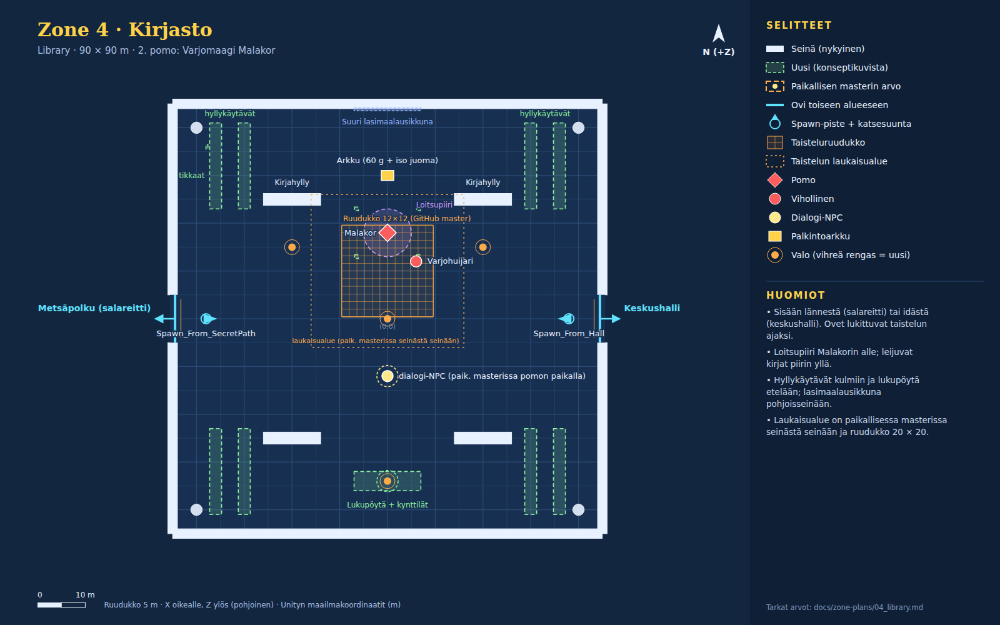

# Zone 4 · Kirjasto (`Zone_4_Library`)

Konseptikuvat: [04a_library_arcane](concepts/04a_library_arcane.jpg) · [04b_library_moon](concepts/04b_library_moon.jpg)

Salatieteen siipi. Sisään lännestä salareitiltä tai idästä keskushallista. Hyllykäytävät kulmissa, loitsupiiri Malakorin alla, suuri lasimaalausikkuna pohjoisseinässä ja pitkä lukupöytä etelässä.

Pelaajan aloituspaikka scenessä (-35, 0.5, 0). Directional nyt: väri #598cf2, int 1, rotaatio (50, -30, 0).

## Paikallisen masterin erot (käytä niitä)

- Laukaisualue on paikallisessa masterissa seinästä seinään, joten Malakorin ohi ei pääse kiertämällä keskushalliin.
- Ruudukko on paikallisessa masterissa 20 × 20 (32 m) ja liukuu sankarin luo.
- Dialogi-NPC seisoo pomon paikalla ja dialogi alkaa automaattisesti laukaisualueella.
- Käytä näissä paikallisen masterin arvoja.

## Nykyiset (GitHub master, pidä ennallaan)

| Nimi | Tyyppi | Sijainti (x, y, z) | Koko (x × y × z) | Rot Y | Collider | Rakennus / huomio |
|---|---|---|---|---|---|---|
| Library_Floor | lattia | (0, -0.5, 0) | 90 × 1 × 90 | 0 | kyllä | Cube, M_Ruined_walls.mat |
| Library_Wall_North | seinä | (0, 4, 45) | 90 × 8 × 2 | 0 | kyllä | Cube |
| Library_Wall_South | seinä | (0, 4, -45) | 90 × 8 × 2 | 0 | kyllä | Cube |
| Library_Wall_West_L | seinä | (-45, 4, -25) | 2 × 8 × 40 | 0 | kyllä | Cube |
| Library_Wall_West_R | seinä | (-45, 4, 25) | 2 × 8 × 40 | 0 | kyllä | Cube |
| Library_Wall_East_L | seinä | (45, 4, -25) | 2 × 8 × 40 | 0 | kyllä | Cube |
| Library_Wall_East_R | seinä | (45, 4, 25) | 2 × 8 × 40 | 0 | kyllä | Cube |
| Library_Pillar ×4 | pilari | (-40, 0, 40); (40, 0, 40); (-40, 0, -40); (40, 0, -40) | r 1.2 m, korkeus 8 | 0 | kyllä | Pillar.prefab, scale (1.2, 1.6, 1.2) |
| Bookshelf ×4 | seinä | (-20, 3.5, 25); (20, 3.5, 25); (-20, 3.5, -25); (20, 3.5, -25) | 12 × 7 × 2.5 | 0 | kyllä | Cube, M_Logs.mat |
| ArcaneLight_Center | valo | (0, 6.5, 0) | piste, #408cff, range 32, int 2.5 | 0 |  | shadows Soft |
| ArcaneLight_East | valo | (20, 5, 15) | piste, #7340f2, range 22, int 2 | 0 |  | shadows Soft |
| ArcaneLight_West | valo | (-20, 5, 15) | piste, #7340f2, range 22, int 2 | 0 |  | shadows Soft |
| Spawn_From_SecretPath | spawn | (-38, 0.5, 0) |  | 90 |  | StartSpawnPoint + trigger 2 x 2 x 2 |
| Spawn_From_Hall | spawn | (38, 0.5, 0) |  | -90 |  | StartSpawnPoint + trigger 2 x 2 x 2 |
| Door_Library_SecretPath | ovi | (-44.5, 0, 0) | aukko 10 m, trigger 6 × 4 × 3 | -90 |  | → `Zone_2_ForestPath` / `Spawn_From_Library`; kehote "Slip through Secret Passage to Whispering Woods" CreateSceneDoorway: Arch.prefab x1.4 + 2x Pillar.prefab, DoorTeleporter-trigger 6 x 4 x 3 m |
| Door_Library_CastleHall | ovi | (44.5, 0, 0) | aukko 10 m, trigger 6 × 4 × 3 | 90 |  | → `Zone_5_CastleHall` / `Spawn_From_Library`; kehote "Enter Great Central Hall (Safe Haven Hub)" CreateSceneDoorway: Arch.prefab x1.4 + 2x Pillar.prefab, DoorTeleporter-trigger 6 x 4 x 3 m |
| Barrier_West | este | (-44, 3.5, 0) | 1.5 × 7 × 8 | 0 | kyllä | Cube M_HammerJAanvil, näkyy taistelun ajan |
| Barrier_East | este | (44, 3.5, 0) | 1.5 × 7 × 8 | 0 | kyllä | sama |
| CombatGrid_Library | taisteluruudukko | (0, 0.05, 10) | 12 × 12 ruutua × 1.6 m | 0 |  | CombatGrid.prefab Paikallisessa masterissa 20 × 20 ja liukuu sankarin luo. |
| Shadow_Decoy | vihollinen | (6, 0.9, 12) |  | 0 |  | EnemyUnit "Shadow Decoy" HP 18, AC 12, DMG 4 |
| Boss_ShadowMageMalakor | pomo | (0, 1.1, 18) |  | 0 |  | ShadowMageMalakorBoss |
| Library_Reward_Chest | arkku | (0, 0.4, 30) |  | 0 |  | Chest.prefab, 60 g + Item_GreaterPotion; näkyy voiton jälkeen |
| Library_Encounter_Trigger | laukaisualue | (0, 2.5, 10) | 32 × 6 × 32 | 0 |  | BoxCollider trigger + DungeonRoomController (ShadowMageMalakor) Paikallisessa masterissa seinästä seinään (tarkka z-väli siellä). |

## Paikallisen masterin hallinnoimat (älä muuta tämän piirroksen mukaan)

| Nimi | Tyyppi | Sijainti (x, y, z) | Koko (x × y × z) | Rot Y | Collider | Rakennus / huomio |
|---|---|---|---|---|---|---|
| NPC_Malakor | dialogi-NPC | (0, 1, -12) |  | 0 |  | VillageNPC + Malakor_Intro.asset |

## Uudet (rakennetaan konseptikuvien mukaan)

| Nimi | Tyyppi | Sijainti (x, y, z) | Koko (x × y × z) | Rot Y | Collider | Rakennus / huomio |
|---|---|---|---|---|---|---|
| Shelf_Aisle ×8 | esine | (-36, 0, 32); (-30, 0, 32); (36, 0, 32); (30, 0, 32); (-36, 0, -32); (-30, 0, -32); (36, 0, -32); (30, 0, -32) | 2.5 × 7 × 18 | 0 | kyllä | Kuten Bookshelf_*: runko M_Logs + kirjarivit (ohuet värilliset kuutiot) |
| Stained_Glass_Window | ikkuna | (0, 4.25, 43.85) | 14 × 6.5 × 0.3 | 0 | ei | Kehys + emissive-lasiruudut (#5a7ad0, #8aa8f0, #c87a9a, #7ac0c0, #d0c07a) |
| Window_Moon_Spot | valo | (0, 7.5, 42) | spot, #9ab8ff, range 30, int 2 | 0 |  | versio: B (kuunvalo) Spot, rot (35, 180, 0), kulma 50°, shadows None |
| Reading_Table | esine | (0, 0, -34) | 14 × 0.9 × 4 | 0 | kyllä | Pöytä 14 × 0.9 × 3 + penkit molemmin puolin; kirjoja, kääröjä ja kynttilöitä (emissive) |
| Reading_Candles | valo | (0, 1.6, -34) | piste, #ffbf6a, range 10, int 1.2 | 0 |  | shadows None |
| Ladder | esine | (-37.8, 0, 36) | 1 × 6 × 0.4 | 90 | ei | Puutikkaat nojaamassa hyllyyn (kallistus 12°) |
| Magic_Circle | pyöreä esine | (0, 0.02, 18) | r 5 m, korkeus 0.02 | 0 | ei | Lattiadecal/litteä levy, emissive violetti #b06aff, riimurengas + pentagrammi |
| Circle_Glow | valo | (0, 1.2, 18) | piste, #c070ff, range 10, int 2 | 0 |  | Sykkii 0.6 Hz; shadows None |
| Floating_Books | efekti | (0, 3.5, 18) |  | 0 | ei | 14 kirjaa (0.4 × 0.1 × 0.3) kiertää r 3–7 m, y 2–5 m; kevyt bob-skripti tai Animator; kipinät #d8a8ff (40 partikkelia) |
| Candle_Cluster ×4 | esine | (-6.5, 0, 13); (6.5, 0, 13); (-6.5, 0, 23); (6.5, 0, 23) | 0.8 × 0.4 × 0.8 | 0 | ei | 3–5 kynttilää, emissive, ei valoa |

## Valaistus ja tunnelma

Oletus: **A · Loitsupiiri + B:n ikkuna**.

**A · Loitsupiiri (oletus)**

- Directional: #5a4a8a, intensiteetti 0.35 (sisätila, lähes pois).
- Ambient: Flat #22163a.
- Sumu: Exponential Squared #1a1030, tiheys 0.012.
- Nykyiset siniset ja violetit Arcane-valot jäävät. Loitsupiirin hehku #c070ff sykkii.
- Leijuvat kirjat ja kipinät piirin yllä.

**B · Kuunvalo (lisänä)**

- Lasimaalausikkuna emissive; Window_Moon_Spot (#9ab8ff, int 2.0) heittää valojuovan lattialle.
- Lukupöydän kynttilät (#ffbf6a) lämpimänä vastavärinä. Pölyhiukkaset #c8d8ff valojuovassa.

## Pelilliset huomiot

- Pidä sisääntulokäytävät (z -5…5) molemmista ovista keskelle vapaina.
- Loitsupiiri, kynttilät ja leijuvat kirjat ovat ilman collideria, joten ne eivät estä ruutuja.
- Jos laukaisualue kattaa sisääntulot, dialogi alkaa heti saapuessa. Se on paikallisen masterin ratkaisu, ei tämän piirroksen.
