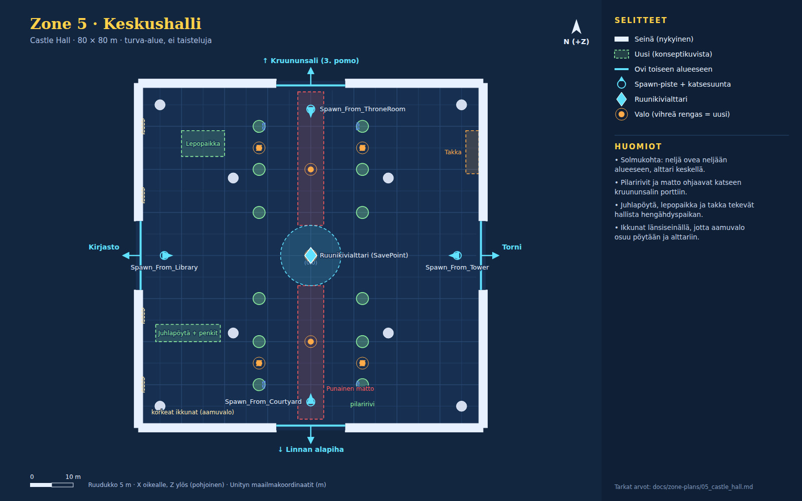

# Zone 5 · Keskushalli (`Zone_5_CastleHall`)

Konseptikuvat: [05a_hall_altar](concepts/05a_hall_altar.jpg) · [05b_hall_dawn](concepts/05b_hall_dawn.jpg)

Turva-alue ja solmukohta: neljä ovea neljään alueeseen ja Ruunikivialttari keskellä. Pilaririvit ja matto johtavat kruununsalin porttiin. Länsiseinän ikkunoista tulee aamuvalo; juhlapöytä, lepopaikka ja takka.

Pelaajan aloituspaikka scenessä (0, 0.5, -32). Directional nyt: väri #ffe0a6, int 1.25, rotaatio (50, -30, 0).

## Nykyiset (GitHub master, pidä ennallaan)

| Nimi | Tyyppi | Sijainti (x, y, z) | Koko (x × y × z) | Rot Y | Collider | Rakennus / huomio |
|---|---|---|---|---|---|---|
| CentralHall_Floor | lattia | (0, -0.5, 0) | 80 × 1 × 80 | 0 | kyllä | Cube, M_Ruined_walls.mat |
| Hall_Wall_South_L | seinä | (-24, 4, -40) | 32 × 8 × 2 | 0 | kyllä | Cube |
| Hall_Wall_South_R | seinä | (24, 4, -40) | 32 × 8 × 2 | 0 | kyllä | Cube |
| Hall_Wall_North_L | seinä | (-24, 4, 40) | 32 × 8 × 2 | 0 | kyllä | Cube |
| Hall_Wall_North_R | seinä | (24, 4, 40) | 32 × 8 × 2 | 0 | kyllä | Cube |
| Hall_Wall_West_S | seinä | (-40, 4, -24) | 2 × 8 × 32 | 0 | kyllä | Cube |
| Hall_Wall_West_N | seinä | (-40, 4, 24) | 2 × 8 × 32 | 0 | kyllä | Cube |
| Hall_Wall_East_S | seinä | (40, 4, -24) | 2 × 8 × 32 | 0 | kyllä | Cube |
| Hall_Wall_East_N | seinä | (40, 4, 24) | 2 × 8 × 32 | 0 | kyllä | Cube |
| Hall_Pillar ×4 | pilari | (-35, 0, 35); (35, 0, 35); (-35, 0, -35); (35, 0, -35) | r 1.2 m, korkeus 8 | 0 | kyllä | Pillar.prefab, scale (1.2, 1.6, 1.2) |
| Hall_Inner_Col ×4 | pilari | (-18, 0, 18); (18, 0, 18); (-18, 0, -18); (18, 0, -18) | r 1.2 m, korkeus 8 | 0 | kyllä | Pillar.prefab, scale (1.2, 1.6, 1.2) |
| SanctuaryLight_Center | valo | (0, 7.5, 0) | piste, #ffe699, range 35, int 3 | 0 |  | shadows Soft |
| SanctuaryLight_South | valo | (0, 6, -20) | piste, #ffcc80, range 24, int 2 | 0 |  | shadows Soft |
| SanctuaryLight_North | valo | (0, 6, 20) | piste, #ffcc80, range 24, int 2 | 0 |  | shadows Soft |
| Rune_Save_Shrine | alttari | (0, 0, 0) | 3 × 2.5 × 3 | 0 | kyllä | Altar.prefab + SavePoint + BoxCollider (3, 2.5, 3) center y 1.2; Rune_Crystal (0, 1.4, 0) 0.6 × 1.2 × 0.6 rot 45; ShrineGlow (0, 2.2, 0) syaani (0.2, 0.9, 1.0) range 14 int 2.5 |
| Spawn_From_Courtyard | spawn | (0, 0.5, -34) |  | 0 |  | StartSpawnPoint + trigger 2 x 2 x 2 |
| Spawn_From_Library | spawn | (-34, 0.5, 0) |  | 90 |  | StartSpawnPoint + trigger 2 x 2 x 2 |
| Spawn_From_Tower | spawn | (34, 0.5, 0) |  | -90 |  | StartSpawnPoint + trigger 2 x 2 x 2 |
| Spawn_From_ThroneRoom | spawn | (0, 0.5, 34) |  | 180 |  | StartSpawnPoint + trigger 2 x 2 x 2 |
| Door_Hall_Courtyard | ovi | (0, 0, -39.5) | aukko 16 m, trigger 8 × 4 × 3 | 180 |  | → `Zone_3_CastleCourtyard` / `Spawn_From_Hall`; kehote "Return to Courtyard (Wing 1)" CreateSceneDoorway: Arch.prefab x1.4 + 2x Pillar.prefab, DoorTeleporter-trigger 8 x 4 x 3 m |
| Door_Hall_Library | ovi | (-39.5, 0, 0) | aukko 16 m, trigger 8 × 4 × 3 | -90 |  | → `Zone_4_Library` / `Spawn_From_Hall`; kehote "Enter Arcane Library (Wing 2)" CreateSceneDoorway: Arch.prefab x1.4 + 2x Pillar.prefab, DoorTeleporter-trigger 8 x 4 x 3 m |
| Door_Hall_Tower | ovi | (39.5, 0, 0) | aukko 16 m, trigger 8 × 4 × 3 | 90 |  | → `Zone_6_Tower` / `Spawn_From_Hall`; kehote "Ascend Spiral Stairs into Treasure Tower" CreateSceneDoorway: Arch.prefab x1.4 + 2x Pillar.prefab, DoorTeleporter-trigger 8 x 4 x 3 m |
| Door_Hall_ThroneRoom | ovi | (0, 0, 39.5) | aukko 16 m, trigger 8 × 4 × 3 | 0 |  | → `Zone_7_ThroneRoom` / `Spawn_From_Hall`; kehote "Confront Final Boss in Crown Hall (Wing 3)" CreateSceneDoorway: Arch.prefab x1.4 + 2x Pillar.prefab, DoorTeleporter-trigger 8 x 4 x 3 m |

## Uudet (rakennetaan konseptikuvien mukaan)

| Nimi | Tyyppi | Sijainti (x, y, z) | Koko (x × y × z) | Rot Y | Collider | Rakennus / huomio |
|---|---|---|---|---|---|---|
| Carpet ×2 | esine | (0, 0.01, -22.5); (0, 0.01, 22.5) | 6 × 0.02 × 31 | 0 | ei | Litteä levy, punainen #a8242e reunus #8a1a24 |
| Altar_Rune_Ring | pyöreä esine | (0, 0.02, 0) | r 7 m, korkeus 0.02 | 0 | ei | Lattiadecal, syaani #5ad8ff emissive riimurengas |
| Altar_Light_Pillar | efekti | (0, 0, 0) |  | 0 | ei | Additiivinen sylinteri r 0.8, korkeus 10 m (#aaf4ff, alpha 0.25) + nousevat hiukkaset |
| Nave_Pillar ×12 | pilari | (-12, 0, -30); (-12, 0, -20); (-12, 0, -10); (-12, 0, 10); (-12, 0, 20); (-12, 0, 30); (12, 0, -30); (12, 0, -20); (12, 0, -10); (12, 0, 10); (12, 0, 20); (12, 0, 30) | r 1.4 m, korkeus 8 | 0 | kyllä | Pillar.prefab, scale (1.2, 1.6, 1.2) kuten Hall_Pillar |
| Torch_Stand ×4 | soihtu | (-12, 0, -25); (12, 0, -25); (-12, 0, 25); (12, 0, 25) | 0.5 × 1.8 × 0.5 | 0 | kyllä | Jalallinen soihtu + liekkipartikkeli |
| Torch_Light ×4 | valo | (-12, 2.2, -25); (12, 2.2, -25); (-12, 2.2, 25); (12, 2.2, 25) | piste, #ffb347, range 9, int 1.4 | 0 |  | shadows None, värinä |
| Banner_Nave ×4 | viiri | (-10.9, 5, -30) rot 90; (10.9, 5, -30) rot -90; (-10.9, 5, 30) rot 90; (10.9, 5, 30) rot -90 | 1.6 × 4 × 0.15 | ks. sijainnit | ei | Sininen viiri #2a4a9a, kultainen tunnus #e8c35a, pilarin keskilaivan puolella |
| Banquet_Table | esine | (-28.5, 0, -18) | 15 × 0.9 × 4 | 0 | kyllä | Pöytä 13 × 0.9 × 2.2 + 2 penkkiä 13 × 0.5 × 0.6; ruokaa, kynttilät, kannut |
| Fireplace | esine | (37.5, 0, 24) | 3 × 5 × 10 | 0 | kyllä | Kivitakka, aukko länteen (-X); tulipartikkelit; viiri yläpuolella (38.8, 6, 24) |
| Fireplace_Fire | valo | (36, 1.2, 24) | piste, #ff9a3a, range 12, int 2 | 0 |  | Värisee; shadows None |
| Rest_Area | esine | (-25, 0, 26) | 10 × 1 × 6 | 0 | kyllä | Matto 10 × 6 (ei collideria), 2 makuualustaa, Barrel, Box_2, matala pöytä |
| Tall_Window ×4 | ikkuna | (-38.9, 4.5, -30); (-38.9, 4.5, -14); (-38.9, 4.5, 14); (-38.9, 4.5, 30) | 0.3 × 6 × 3.5 | 0 | ei | Kehys + emissive lasi #ffe8b0; valojuova (additiivinen taso) ikkunasta itään |

## Valaistus ja tunnelma

Oletus: **Lämmin turvapaikka + aamuvalo**.

**Oletus: lämmin turvapaikka ja aamuvalo**

- Nykyiset lämpimät valot jäävät. Directional aamuauringoksi länsi-ikkunoista: #ffe0a0, int 1.3, rotaatio (30, 90, 0).
- Ambient: taivas #5a4a48, maa #3a3034.
- Soihdut #ffb347, takka #ff9a3a, alttarin syaani #5ad8ff (ShrineGlow).
- Pölyhiukkaset ikkunoiden valojuovissa (#fff0c8, ~80 kpl).

**Vaihtoehto: soihtuyö (konsepti A)**

- Directional lähes pois (#2a2228, int 0.2); soihdut ja alttari kantavat valaistuksen.

## Pelilliset huomiot

- Ei taisteluita. Pidä neljän oven 16 m aukot ja spawn-pisteet vapaina.
- Pilaririvien välissä on 20 m aukko (z -10…10), joten itä–länsi-akseli kirjastosta torniin pysyy suorana.
- Juhlapöydän ja Hall_Inner_Col_2:n (-18, -18) väliin jää vajaa 1 m. Jos se tuntuu ahtaalta, siirrä pöytää länteen.
- Alttarin SavePoint-collider (3 × 2.5 × 3) säilyy; rengas ja valopilari ovat ilman collideria.
