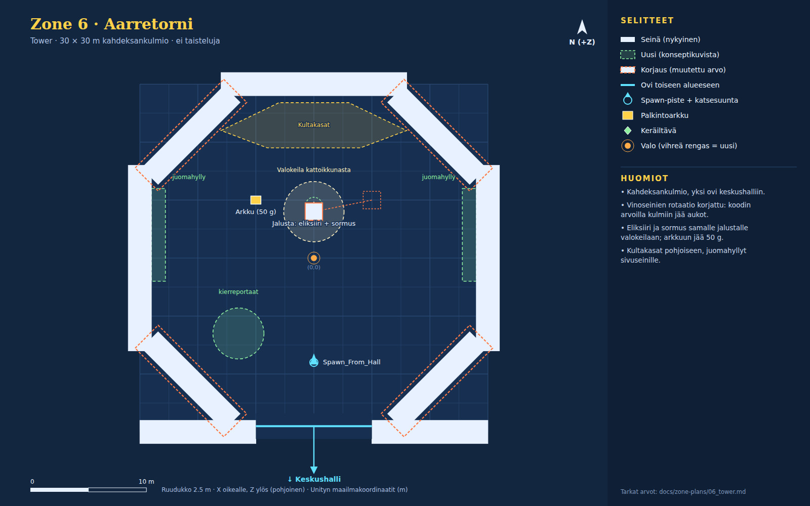

# Zone 6 · Aarretorni (`Zone_6_Tower`)

Konseptikuvat: [06b_tower_treasure](concepts/06b_tower_treasure.jpg) · [06a_tower_exterior](concepts/06a_tower_exterior.jpg)

Pieni kahdeksankulmainen aarrekammio, yksi ovi keskushalliin. Kattoikkunan valokeila osuu keskijalustaan, jolla ovat Othelian sormus ja Jättiläisen eliksiiri. Kultakasat pohjoisessa, juomahyllyt sivuilla.

Pelaajan aloituspaikka scenessä (0, 0.5, -9). Directional nyt: väri #73a6ff, int 1.1, rotaatio (50, -30, 0).

## Nykyiset (GitHub master, pidä ennallaan)

| Nimi | Tyyppi | Sijainti (x, y, z) | Koko (x × y × z) | Rot Y | Collider | Rakennus / huomio |
|---|---|---|---|---|---|---|
| Tower_Floor | lattia | (0, -0.5, 0) | 30 × 1 × 30 | 0 | kyllä | Cube, M_Ruined_walls.mat |
| Tower_Wall_North | seinä | (0, 4, 15) | 16 × 8 × 2 | 0 | kyllä | Cube |
| Tower_Wall_East | seinä | (15, 4, 0) | 2 × 8 × 16 | 0 | kyllä | Cube |
| Tower_Wall_West | seinä | (-15, 4, 0) | 2 × 8 × 16 | 0 | kyllä | Cube |
| Tower_Wall_South_L | seinä | (-10, 4, -15) | 10 × 8 × 2 | 0 | kyllä | Cube |
| Tower_Wall_South_R | seinä | (10, 4, -15) | 10 × 8 × 2 | 0 | kyllä | Cube |
| TowerLight_Center | valo | (0, 6.5, 0) | piste, #8cd9ff, range 24, int 2.5 | 0 |  | shadows Soft; oletustunnelmassa int → 1.0 |
| Spawn_From_Hall | spawn | (0, 0.5, -9) |  | 0 |  | StartSpawnPoint + trigger 2 x 2 x 2 |
| Door_Tower_CastleHall | ovi | (0, 0, -14.5) | aukko 10 m, trigger 6 × 4 × 3 | 180 |  | → `Zone_5_CastleHall` / `Spawn_From_Tower`; kehote "Return to Great Central Hall" CreateSceneDoorway: Arch.prefab x1.4 + 2x Pillar.prefab, DoorTeleporter-trigger 6 x 4 x 3 m |
| Tower_Reward_Chest | arkku | (-5, 0.4, 5) |  | 0 |  | Chest.prefab + ChestRewardInteraction 50 g + Item_SignetRing (oletuksessa sormus siirtyy jalustalle, arkkuun jää 50 g) |

## Korjaukset (olemassa oleva objekti, muutettu arvo)

| Nimi | Tyyppi | Sijainti (x, y, z) | Koko (x × y × z) | Rot Y | Collider | Rakennus / huomio |
|---|---|---|---|---|---|---|
| Wall_NE | seinä | (10.6, 4, 10.6) | 2 × 8 × 10 | **-45** (nyt 45) | kyllä | Cube Koodissa rot 45, joka kääntää seinän säteittäiseksi: sen kummallekin puolelle jää noin 3 m rako lattian reunalle. Oikea arvo -45. |
| Wall_NW | seinä | (-10.6, 4, 10.6) | 2 × 8 × 10 | **45** (nyt -45) | kyllä | Cube Koodissa -45, oikea 45. |
| Wall_SE | seinä | (10.6, 4, -10.6) | 2 × 8 × 10 | **45** (nyt -45) | kyllä | Cube Koodissa -45, oikea 45. |
| Wall_SW | seinä | (-10.6, 4, -10.6) | 2 × 8 × 10 | **-45** (nyt 45) | kyllä | Cube Koodissa 45, oikea -45. |
| GiantElixir_Pedestal | jalusta | **(0, 0.5, 4)** (nyt (5, 0.5, 5)) | 1.5 × 1 × 1.5 | 0 |  | Cube M_Rocks_1_2 + GiantElixirInteraction, collider 2.5 × 2 × 2.5; Elixir_Vial (0, 0.8, 0); ElixirGlow (0, 1.5, 0) range 8 int 2 Nykyään (5, 0.5, 5). Piirroksen mukaan valokeilan keskelle (0, 0.5, 4). |

## Uudet (rakennetaan konseptikuvien mukaan)

| Nimi | Tyyppi | Sijainti (x, y, z) | Koko (x × y × z) | Rot Y | Collider | Rakennus / huomio |
|---|---|---|---|---|---|---|
| SignetRing_Pickup | keräiltävä | (0, 1.15, 4.5) |  | 0 |  | Sormusmalli jalustalla + ChestRewardInteraction (gold 0, Item_SignetRing), kuten suoyrtit Sormus pois arkusta (ItemReward → null). Jos tämä tuntuu liian isolta muutokselta, jätä sormus arkkuun. |
| Skylight_Beam | pyöreä esine | (0, 0, 4) | r 2.6 m, korkeus 9.5 | 0 | ei | Additiivinen kartio r 2.6 + Spot alla |
| Skylight_Spot | valo | (0, 9.5, 4) | spot, #fff0c0, range 14, int 3 | 0 |  | rot (90, 0, 0) suoraan alas, kulma 35°, shadows None |
| Gold_Piles | alue | monikulmio (-8, 11), (-3, 13.4), (3, 13.4), (8, 11), (4, 9.5), (-4, 9.5) |  | 0 | ei | Matala kultakasa (0.6–1.0 m) + yksittäisiä kolikoita; yhdistä yhdeksi staattiseksi meshiksi, ei Pickup-skriptejä |
| Gold_Glow | valo | (0, 1.5, 11) | piste, #ffcc4a, range 8, int 1.2 | 0 |  | shadows None |
| Potion_Shelf ×2 | esine | (-13.4, 0, 2); (13.4, 0, 2) | 1.2 × 3 × 8 | 0 | kyllä | Hylly 2 tasoa × 6 pulloa, emissive (#d83a3a, #3a8ad8, #6ad83a, #c83ad8) |
| Spiral_Stairs | pyöreä esine | (-6.5, 0, -6.5) | r 2.2 m, korkeus 6 | 0 | kyllä | Stairs.prefab-kierre tai kuutioaskelmat, johtaa ylös (koriste) |

## Valaistus ja tunnelma

Oletus: **B · Aarrekammio**.

**B · Aarrekammio (oletus)**

- Skylight_Spot (#fff0c0, int 3) valokeilana jalustalle; TowerLight_Center int 2.5 → 1.0 (viileä täyte).
- Kultakasat emissive + Gold_Glow (#ffcc4a). Juomapullot emissive.
- Eliksiiri: konseptissa punainen lasi #e02a4a ja hehku #ff3a5a (nyt kulta). Valinnainen.
- Pölyhiukkaset valokeilassa (#fff0c0, ~90 kpl).

**A · Torni ulkoa hämärässä**

- Ei rakennettavissa tähän sceneen (sisätila). Käytä retkikartan kuvakkeena tai latausruutuna.

## Pelilliset huomiot

- Tarkista ensin kulmat: jos lattian kulmissa on aukot (koodin rotaatioilla on), korjaa vinoseinien rot (NE -45, NW 45, SE 45, SW -45).
- Kulkureitti ovelta (0, -14.5) jalustalle pysyy suorana; kierreportaat ovat sivussa.
- Jos sormus siirretään jalustalle, tarkista, ettei Othelian tehtävä oleta sormuksen tulevan arkusta.
