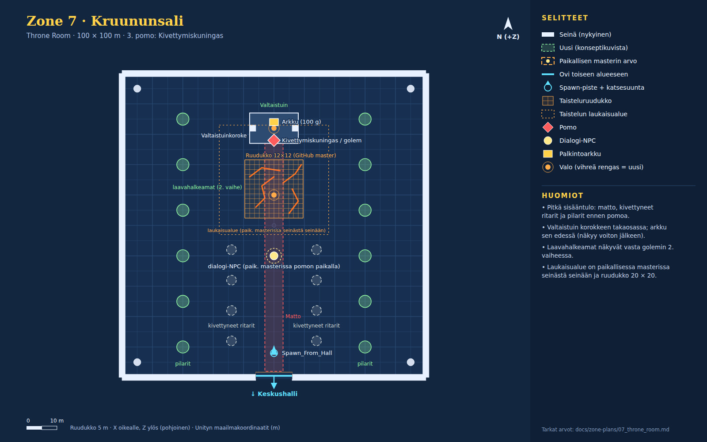

# Zone 7 · Kruununsali (`Zone_7_ThroneRoom`)

Konseptikuvat: [07a_throne_petrify](concepts/07a_throne_petrify.jpg) · [07b_throne_golem](concepts/07b_throne_golem.jpg)

Pitkä sali etelästä valtaistuimelle. Matto ja kivettyneet ritarit rakentavat jännitettä. Ensimmäisessä vaiheessa kylmä turkoosi valo, golemin toisessa vaiheessa lattia halkeilee laavana.

Pelaajan aloituspaikka scenessä (0, 0.5, -42). Directional nyt: väri #ff6633, int 1.3, rotaatio (50, -30, 0).

## Paikallisen masterin erot (käytä niitä)

- Laukaisualue on paikallisessa masterissa seinästä seinään, ja kuninkaan dialogi alkaa aina ennen valtaistuinta.
- Ruudukko on paikallisessa masterissa 20 × 20 (32 m) ja liukuu sankarin luo.
- Dialogi-NPC seisoo pomon paikalla. Käytä näissä paikallisen masterin arvoja.

## Nykyiset (GitHub master, pidä ennallaan)

| Nimi | Tyyppi | Sijainti (x, y, z) | Koko (x × y × z) | Rot Y | Collider | Rakennus / huomio |
|---|---|---|---|---|---|---|
| ThroneRoom_Floor | lattia | (0, -0.5, 0) | 100 × 1 × 100 | 0 | kyllä | Cube, M_Ruined_walls.mat |
| ThroneRoom_Wall_North | seinä | (0, 4.5, 50) | 100 × 9 × 2 | 0 | kyllä | Cube |
| ThroneRoom_Wall_West | seinä | (-50, 4.5, 0) | 2 × 9 × 100 | 0 | kyllä | Cube |
| ThroneRoom_Wall_East | seinä | (50, 4.5, 0) | 2 × 9 × 100 | 0 | kyllä | Cube |
| ThroneRoom_Wall_South_L | seinä | (-28, 4.5, -50) | 44 × 9 × 2 | 0 | kyllä | Cube |
| ThroneRoom_Wall_South_R | seinä | (28, 4.5, -50) | 44 × 9 × 2 | 0 | kyllä | Cube |
| Throne_Dais | koroke | (0, 0.6, 32) | 16 × 1.2 × 10 | 0 | kyllä | Cube |
| Throne_Col_L | seinä | (-7, 4.5, 32) | 2 × 9 × 2 | 0 | kyllä | Cube |
| Throne_Col_R | seinä | (7, 4.5, 32) | 2 × 9 × 2 | 0 | kyllä | Cube |
| Throne_Pillar ×4 | pilari | (-45, 0, 45); (45, 0, 45); (-45, 0, -45); (45, 0, -45) | r 1.2 m, korkeus 9 | 0 | kyllä | Pillar.prefab, scale (1.2, 1.8, 1.2) |
| CrownLight_Center | valo | (0, 7.5, 10) | piste, #ff6626, range 35, int 3 | 0 |  | shadows Soft |
| CrownLight_Throne | valo | (0, 6, 32) | piste, #ffd940, range 28, int 2.5 | 0 |  | shadows Soft |
| Spawn_From_Hall | spawn | (0, 0.5, -42) |  | 0 |  | StartSpawnPoint + trigger 2 x 2 x 2 |
| Door_ThroneRoom_CastleHall | ovi | (0, 0, -49.5) | aukko 12 m, trigger 8 × 4 × 3 | 180 |  | → `Zone_5_CastleHall` / `Spawn_From_ThroneRoom`; kehote "Return to Great Central Hall (Hub)" CreateSceneDoorway: Arch.prefab x1.4 + 2x Pillar.prefab, DoorTeleporter-trigger 8 x 4 x 3 m |
| Barrier_South | este | (0, 4, -49) | 12 × 8 × 1.5 | 0 | kyllä | Cube M_HammerJAanvil, näkyy taistelun ajan |
| CombatGrid_CrownHall | taisteluruudukko | (0, 0.05, 12) | 12 × 12 ruutua × 1.6 m | 0 |  | CombatGrid.prefab Paikallisessa masterissa 20 × 20 ja liukuu sankarin luo. |
| Boss_GargoyleKing | pomo | (0, 1.8, 28) |  | 0 |  | GargoyleKingBoss (golem vaihtaa 2. vaiheen malliin puolessa HP:ssa) |
| CrownHall_Treasure_Chest | arkku | (0, 1.4, 34) |  | 0 |  | Chest.prefab 100 g; näkyy voiton jälkeen |
| CrownHall_Encounter_Trigger | laukaisualue | (0, 2.5, 15) | 36 × 6 × 36 | 0 |  | BoxCollider trigger + DungeonRoomController (GargoyleKing) Paikallisessa masterissa seinästä seinään (tarkka z-väli siellä). |

## Paikallisen masterin hallinnoimat (älä muuta tämän piirroksen mukaan)

| Nimi | Tyyppi | Sijainti (x, y, z) | Koko (x × y × z) | Rot Y | Collider | Rakennus / huomio |
|---|---|---|---|---|---|---|
| NPC_GargoyleKing | dialogi-NPC | (0, 1.2, -10) |  | 0 |  | VillageNPC + GargoyleKing_Intro.asset |

## Uudet (rakennetaan konseptikuvien mukaan)

| Nimi | Tyyppi | Sijainti (x, y, z) | Koko (x × y × z) | Rot Y | Collider | Rakennus / huomio |
|---|---|---|---|---|---|---|
| Carpet | esine | (0, 0.01, -10.5) | 6 × 0.02 × 75 | 0 | ei | Litteä levy, punainen; ovelta korokkeen eteen (z -48…27) |
| Petrified_Knight ×8 | pyöreä esine | (-14, 0, -38) rot 90; (-14, 0, -28) rot 90; (-14, 0, -18) rot 90; (-14, 0, -8) rot 90; (14, 0, -38) rot -90; (14, 0, -28) rot -90; (14, 0, -18) rot -90; (14, 0, -8) rot -90 | r 1.6 m, korkeus 3.7 | ks. sijainnit | kyllä | Jalusta 2 × 0.5 × 2 + harmaa kivipatsas 1.2 × 3.2 × 1.2 (#8a9290), vaihtelevat asennot (kilpi/kypärä tai huppu) |
| Hall_Column ×12 | pilari | (-30, 0, -40); (-30, 0, -25); (-30, 0, -10); (-30, 0, 5); (-30, 0, 20); (-30, 0, 35); (30, 0, -40); (30, 0, -25); (30, 0, -10); (30, 0, 5); (30, 0, 20); (30, 0, 35) | r 2 m, korkeus 9 | 0 | kyllä | Pillar.prefab, scale (1.6, 1.8, 1.6) |
| Throne | esine | (0, 1.2, 35.6) | 4 × 5 × 2.2 | 180 | kyllä | Korkeaselkäinen kivivaltaistuin korokkeen takaosassa, kasvot etelään; 2. vaiheessa rikottu versio (valinnainen) |
| Lava_Cracks | halkeamat | (-6, 6) → (-3, 9) → (-4, 13) → (0, 16); (5, 4) → (8, 8) → (6, 12); (-8, 16) → (-4, 19) → (2, 18); (3, 14) → (7, 17) → (9, 20) |  | 0 | ei | Emissive-halkeamadecalit (#ff6a1a, hehku #ff9a3a) 0.3–0.5 m leveitä; piilossa 1. vaiheessa, päälle kun golem vaihtaa 2. vaiheen malliin |
| Phase2_Switch | efekti | (0, 0, 0) |  | 0 | ei | Golemin vaihdon hetkellä: Lava_Cracks päälle, valot 2. vaiheen paletille, kipinäpartikkelit (#ffa04a, 60 kpl), lyhyt kameran tärähdys |

## Valaistus ja tunnelma

Oletus: **1. vaihe A, 2. vaihe B**.

**1. vaihe · Kivettynyt hovi (A)**

- Directional: #9fc8c0, int 0.8. Ambient: taivas #2a3436, maa #1a2224.
- Sumu: Linear #9ac8c0, 30–120 m.
- CrownLight_Throne → turkoosi #6af0d0. Kuninkaan silmät #ffe24a. Pölyhiukkaset #d8fff4.

**2. vaihe · Laavahehku (B), golemin vaihdon hetkellä**

- Lava_Cracks päälle (#ff6a1a / #ff9a3a). CrownLight_Center → #ff5a1a int 3.
- Directional takaisin nykyiseen punaoranssiin (1, 0.40, 0.20) int 1.3.
- Kipinäpartikkelit #ffa04a (60 kpl), lyhyt kameran tärähdys.

## Pelilliset huomiot

- Pomo seisoo korokkeella (0, 28). Paikallisessa masterissa ruudukko liukuu, joten tarkista, että pomo on ruudukolla taistelun alkaessa.
- Laavahalkeamat ja matto ovat ilman collideria, joten ne eivät estä ruutuja.
- Ritarit ja pilarit ovat collidereineen suojia, jos ruudukko liukuu niiden päälle. Keskikäytävä (x -8…8) pysyy vapaana.
- Ainoa ovi on etelässä ja se lukittuu taistelun ajaksi.
